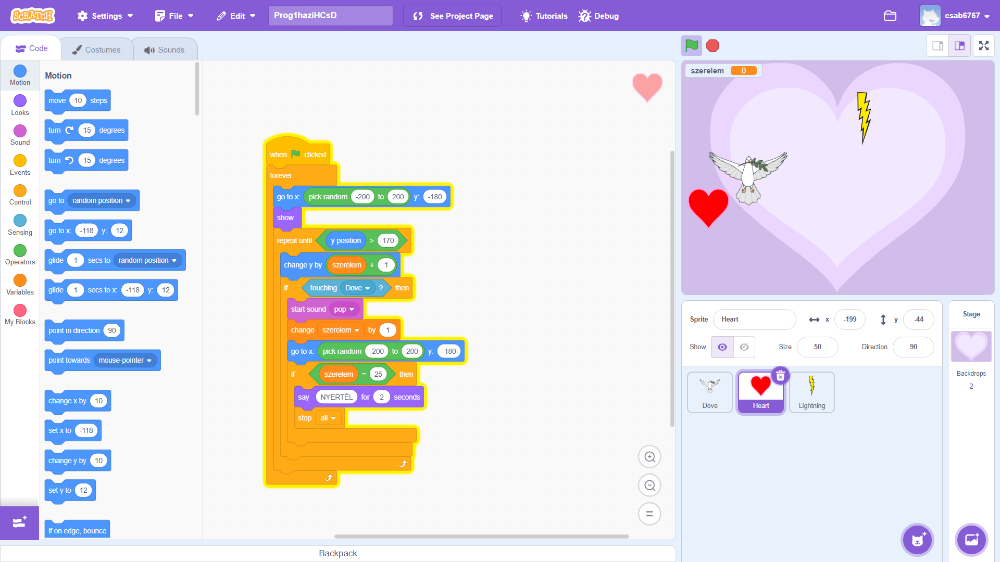

# Szerelem Küldetése

Ez egy interaktív, Valentin-napi témájú Scratch minijáték, amelyet egy iskolai projekt keretében készítettem. 
A játékban a játékos Ámort (egy repülő karaktert) irányítja az egerével. A cél, hogy minél több felszálló szerelmes szívet kapjon el, és ezzel növelje a "Szerelem" pontszámot. Eközben viszont ügyesen ki kell kerülnie a fentről lezuhanó viharfelhőket, mert ha hozzájuk ér, megtörik a varázs és a játéknak vége!

## A projekt főbb jellemzői:
- **Karakterek (Sprite-ok):** Ámor (játékos), Piros Szív (gyűjthető) és Villám (akadály).
- **Vezérlés:** A játékos karaktere folyékonyan, az egérmutatót követve mozog.
- **Dinamikus nehézség:** A játék a pontszám alapján egyre nehezedik! A szívek felszállási sebessége és a felhők zuhanási sebessége folyamatosan gyorsul.

## Képernyőmentés a játékról:

